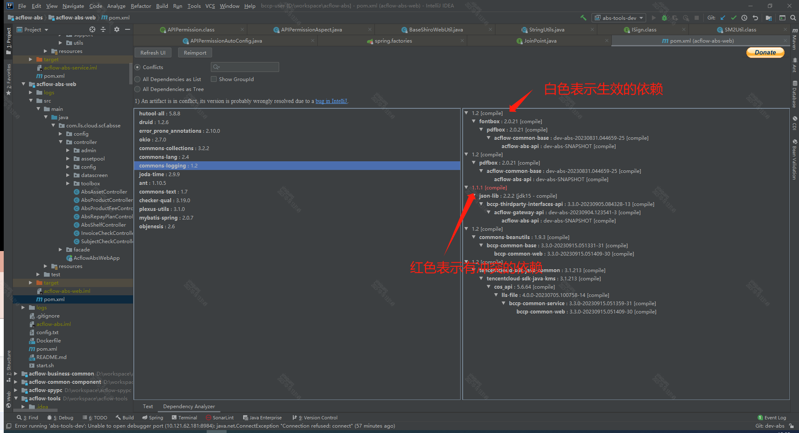

### 解决方式

1. 第一声明优先

   在maven中两个名称相同，版本不同的依赖，先声明的会生效

2. 路径近者优先

   路径指：当前项目依赖的包，又依赖于其他包，这样的一条依赖路径

3. 排除原则

   可用exclude排除不需要的依赖，来避免依赖冲突

   ```java
   <dependency>
           <groupId>org.apache.struts</groupId>
           <artifactId>struts2-spring-plugin</artifactId>
           <version>2.3.24</version>
           <exclusions>
             <exclusion>
               <groupId>org.springframework</groupId>
               <artifactId>spring-beans</artifactId>
             </exclusion>
           </exclusions>
   </dependency>
   ```

4. 版本锁定原则

   在pom文件中直接声明需要依赖的版本

   

### 使用工具分析

Maven helper 插件分析

